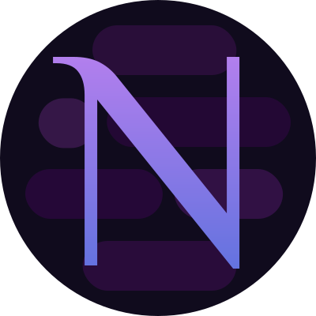

# Nebula

 
  <h3 align="center">Nebula</h3>
  

    My personal diary
     
    <a href="https://github.com/schuler-ph/nebula/issues">Report a bug or request a feature</a>
  

## Description

My private diary app. I use it to write down a few paragraphs for different subjects (general, training, university, projects) and plan my week.

## Hosted Application

The application is already usable through netlify under <a href="https://magnificent-rugelach-0a7290.netlify.app/">this link</a>.
You cannot sign up for an account yet. If you are interested in testing the application, send me an email to schulerp03+nebula@gmail.com.

## Features
### Diary
* Write diary entrys for various subjects

### Todos
* Create Daily Todos (Habits) and record how you perform every day
* Create One-Time Todos

### Training plan
* Create exercises (skills or basics)
* Create a training plan with these exercises
* Assign a training plan to your week
